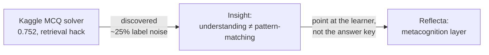
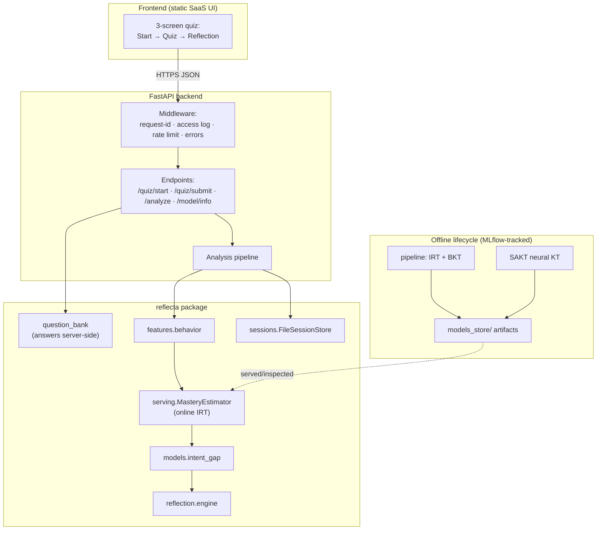
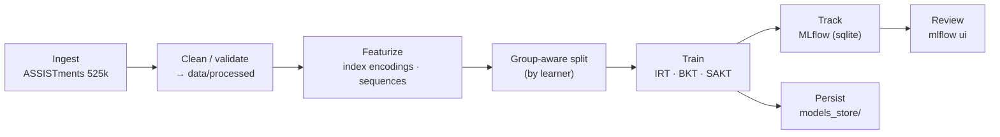
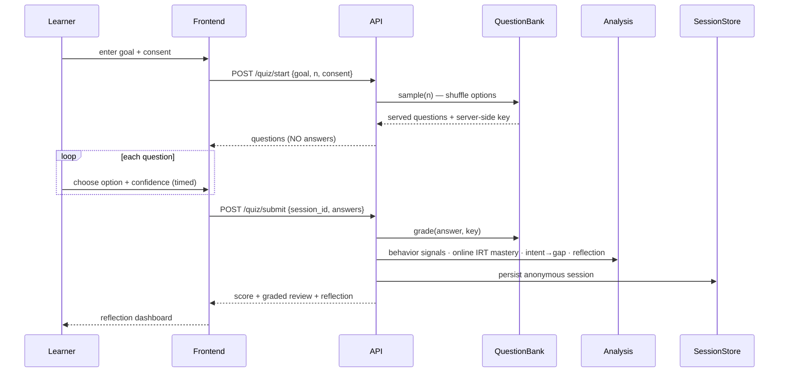
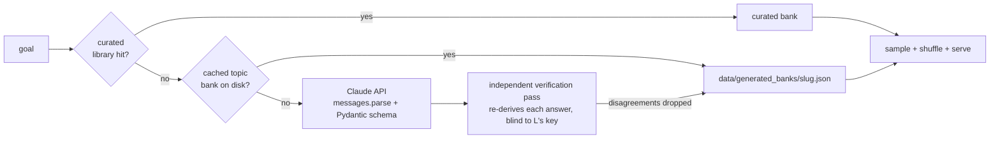
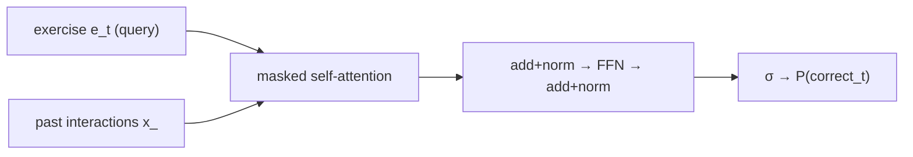
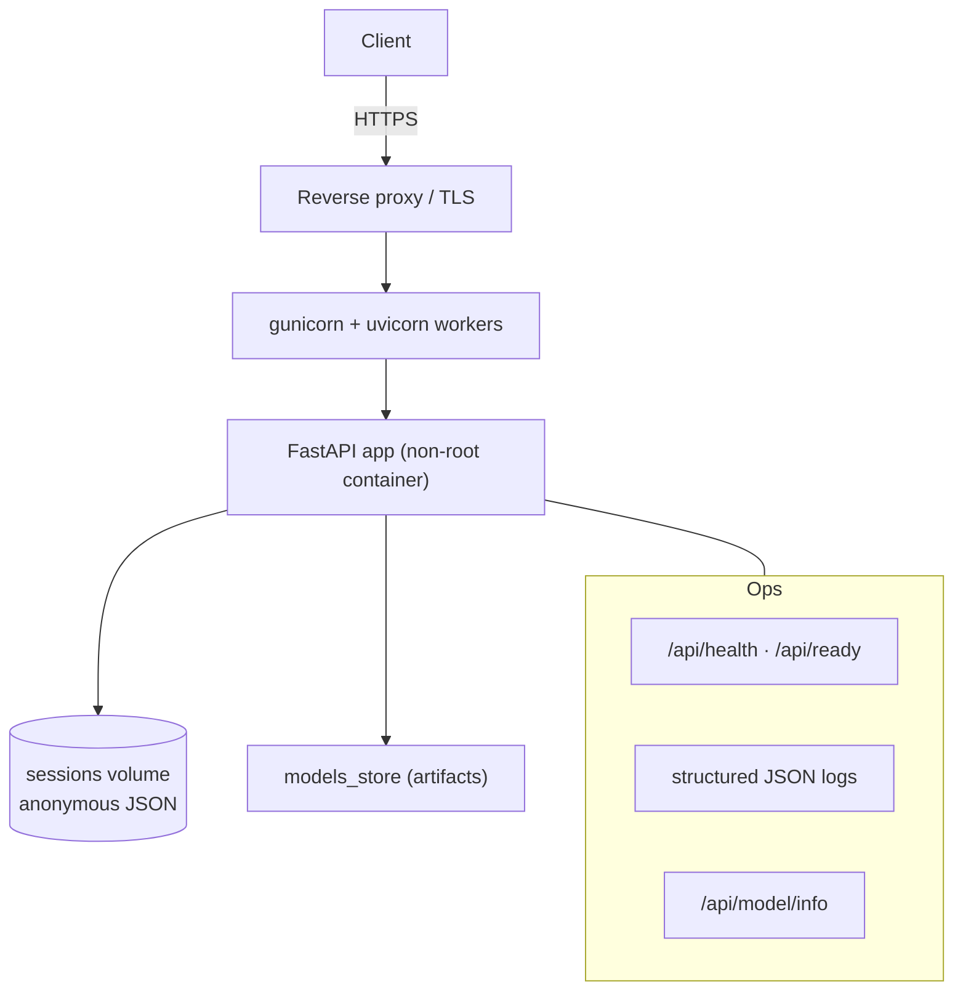

# Reflecta — The Guidebook

> A single document that explains the whole project: the human problem, every concept and
> model (with the math), the architecture, the design decisions, and how to operate it in
> production. Written so a newcomer can understand it — and so you can rebuild your mental
> model years from now.

**Contents**
1. [What Reflecta is, and why](#1-what-reflecta-is-and-why)
2. [Origin story: from a leaky MCQ solver to a metacognition layer](#2-origin-story)
3. [System architecture](#3-system-architecture)
4. [The data lifecycle](#4-the-data-lifecycle)
5. [The live quiz flow](#5-the-live-quiz-flow)
6. [The five signals (with math)](#6-the-five-signals-with-math)
7. [The models (with math)](#7-the-models-with-math)
8. [Evaluation methodology](#8-evaluation-methodology)
9. [Production & compliance](#9-production--compliance)
10. [Design decisions log (ADRs)](#10-design-decisions-log)
11. [Results](#11-results)
12. [Repository map](#12-repository-map)
13. [Glossary](#13-glossary)
14. [Roadmap](#14-roadmap)

---

## 1. What Reflecta is, and why

Reflecta is a **reflective learning intelligence layer** that sits on top of quizzes. A raw
quiz score (say 7/10) hides everything that actually matters for learning:

- Did the learner *understand* the 7, or memorize the phrasing?
- Are the 3 misses one recurring **misconception** or three unrelated gaps?
- Is the learner **over-confident** exactly where they are weakest?
- **Why** are they learning this, and does their current mastery move them toward that goal?

Reflecta infers these from *how* someone interacts with questions — choices, timing,
confidence, and transfer across rephrasings — and returns an honest, specific reflection.
The **hero capability** is **intent → gap mapping**: connect the learner's stated goal to the
concepts they're actually mastering, and surface the shortfall.

**Who it's for:** self-directed learners and edtech content teams who need more than a score.

---

## 2. Origin story

The project began as a Kaggle "Smart MCQ Solver" that plateaued at **0.752 MAP@3**. Error
analysis showed the ceiling was **label noise** — ~25% of the answer keys were wrong or
ambiguous — a fact independently corroborated by published work (**MMLU-Redux** finds 6.49%
of MMLU labels wrong, up to 57% in some subjects). Chasing a higher score was a dead end.

But the analysis surfaced a genuinely useful primitive: *you can separate real understanding
from surface pattern-matching by testing invariance across rephrasings.* Pointed at answer
keys that's a dead end; pointed at **learners** it becomes a product. That pivot is Reflecta.
The legacy write-ups live in `docs/legacy/`.



---

## 3. System architecture



Design guarantees: **self-contained** (everything runs from this directory), **graceful
degradation** (missing signals → NaN, missing tracker → console, missing LLM → rules), and
**explanation is the product** (intent→gap is transparent arithmetic, no black box).

---

## 4. The data lifecycle

The offline path that turns raw public data into usable, tracked, deployable models.



Run it: `python scripts/run_pipeline.py --source assistments` (IRT+BKT) and
`python scripts/train_sakt.py` (SAKT). Both log to a local MLflow SQLite store.

---

## 5. The live quiz flow

Answers never reach the browser; grading is server-side.



### Open topics: Claude-generated question banks

The curated bank covers the data-science-interview goal. Any *other* goal ("social science
study", "modern history", …) is served by a **Claude-generated topic bank**
(`src/reflecta/generation.py`), inspired by Episteme's pattern of using Claude as a
structured pedagogy engine steered by deterministic scaffolding:



Design points:

- **Structured outputs, not prompt-parsing.** `client.messages.parse()` with a Pydantic
  schema (`GeneratedBank`) — the API itself validates the JSON shape; malformed items are
  dropped, and a bank with < 4 valid questions is rejected.
- **The generation prompt encodes the research design**: 3–5 concepts with goal-specific
  `importance`/`target` (feeds intent→gap directly, replacing the curated resolver),
  authored `difficulty` per item (feeds online IRT), **reworded twins** (feeds the
  memorization index), and distractors that each encode a *specific misconception*
  (feeds the distractor signature).
- **Independent answer-key verification.** This is a direct response to the predecessor
  project's core finding — ~25% of a *human-authored* MCQ dataset had wrong or ambiguous
  answer keys (`STORY.md`). An LLM-generated bank is not immune to the same failure. A
  second, batched call (`_verify_bank` in `generation.py`) re-derives each question's answer
  from scratch — the stem and options only, no hint of what the first call marked correct —
  and any question where the two calls disagree is dropped before caching. One extra call per
  *topic* (not per question), fails open on a safety refusal so a blocked verification never
  empties the bank, and the drop count is logged for later auditing.
- **One API call pair per topic, ever** — banks cache to `data/generated_banks/{slug}.json`,
  verification metadata (generated/verified/dropped counts) stored alongside.
- **Graceful degradation** — without `ANTHROPIC_API_KEY`, unknown topics return a clear
  503 explaining how to enable the feature; the curated bank keeps working. Model:
  `claude-haiku-4-5` ($1/$5 per MTok — schema-constrained generation doesn't need a
  frontier model; env-overridable via `REFLECTA_ANTHROPIC_MODEL` if a topic needs more depth).

---

## 6. The five signals (with math)

Let a session be a set of answered items $i = 1..N$, each with concept (skill) $s_i$,
correctness $y_i \in \{0,1\}$, response time $\tau_i$, confidence $c_i \in [0,1]$, and flags
for rephrasing.

### Signal 1 — Memorization vs understanding
Test transfer: does accuracy hold when the *same concept* is reworded? With `is_reworded`
$\in\{0,1\}$ marking original vs transfer probe:

$$
\text{MemIndex} = \operatorname{acc}(\text{reworded}=0) - \operatorname{acc}(\text{reworded}=1)
$$

A large positive value means the learner only recognizes familiar phrasing.
*(`features/behavior.py::memorization_index`)*

### Signal 2 — Misconception diagnosis
On incorrect answers, the distribution of chosen distractors per skill:

$$
\pi_s(o) = \frac{\#\{i : s_i=s,\ y_i=0,\ \text{choice}_i=o\}}{\#\{i : s_i=s,\ y_i=0\}}
$$

A **peaked** $\pi_s$ (one distractor dominates) signals a specific, shared misconception —
later joined with **Eedi's** labeled distractors to *name* it. *(`distractor_signature`)*

### Signal 3 — Calibration (confidence vs reality)
**Brier score** (lower is better):

$$
\text{Brier} = \frac{1}{N}\sum_{i=1}^N (c_i - y_i)^2
$$

**Expected Calibration Error** over $M$ confidence bins $B_1..B_M$:

$$
\text{ECE} = \sum_{m=1}^{M} \frac{|B_m|}{N}\,\big|\operatorname{acc}(B_m) - \operatorname{conf}(B_m)\big|
$$

High confidence with low accuracy ⇒ large ECE ⇒ Dunning–Kruger. *(`eval/metrics.py`)*

### Signal 4 — Intent → gap (the hero)
A goal decomposes into concept **requirements**: importance $w_c \in [0,1]$ and target
mastery $t_c \in [0,1]$. Given the learner's mastery $m_c$ (from online IRT, Signal-adjacent):

$$
\text{gap}_c = w_c \cdot \max(0,\ t_c - m_c)
$$

$$
\text{readiness} = \frac{\sum_c w_c \cdot \min(m_c, t_c)}{\sum_c w_c \cdot t_c} \in [0,1]
$$

**Misallocation** flags concepts the learner spends effort on but the goal barely needs
($\text{effort}_c \ge \text{median}$ and $w_c < 0.15$). *(`models/intent_gap.py`)*

### Signal 5 — Reflection
Deterministic rules turn the above numbers into specific prompts; an optional free/local LLM
only *rephrases* them (never invents facts). *(`reflection/engine.py`)*

---

## 7. The models (with math)

### 7.1 Item Response Theory (IRT-1PL / Rasch)
Separates learner ability from item difficulty so "mastery" is comparable across learners who
saw different questions. For learner $i$, item $j$:

$$
P(y_{ij}=1 \mid \theta_i, b_j) = \sigma(\theta_i - b_j), \qquad \sigma(z)=\frac{1}{1+e^{-z}}
$$

**Offline fit** (maximize log-likelihood by gradient ascent, `models/irt.py`):

$$
\frac{\partial \mathcal{L}}{\partial \theta_i} = \sum_{j}(y_{ij}-p_{ij}), \qquad
\frac{\partial \mathcal{L}}{\partial b_j} = -\sum_{i}(y_{ij}-p_{ij})
$$

**The cold-start problem:** a brand-new learner has no $\theta_i$, so offline IRT scores
~chance on held-out learners (we measured AUC 0.51). Fix below.

### 7.2 Online ability estimation (MAP) — the cold-start fix
Freeze item difficulties $b_j$ (from the question bank's authored difficulty,
$b = (\text{difficulty}-0.5)\cdot\text{scale}$) and estimate just this learner's $\theta$ from
their session, with a Gaussian prior $\theta \sim \mathcal{N}(0,\sigma^2)$:

$$
\theta^\* = \arg\max_\theta\ \sum_i \big[y_i(\theta-b_i) - \log(1+e^{\theta-b_i})\big] - \frac{\theta^2}{2\sigma^2}
$$

Solved by Newton's method:

$$
g(\theta) = \sum_i (y_i - p_i) - \frac{\theta}{\sigma^2}, \qquad
h(\theta) = -\sum_i p_i(1-p_i) - \frac{1}{\sigma^2}, \qquad
\theta \leftarrow \theta - \frac{g(\theta)}{h(\theta)}
$$

The prior is essential: with only 2–4 items per concept, an all-correct run would send the
MLE to $+\infty$; the prior keeps $\theta$ finite and shrinks sparse evidence toward the
population mean. Mastery reported to the UI is $\sigma(\theta)$. *(`models/online_irt.py`)*

### 7.3 Bayesian Knowledge Tracing (BKT)
Mastery **over time** as a 2-state HMM per skill with parameters
$\{p_{L_0}\text{(init)}, p_T\text{(learn)}, p_S\text{(slip)}, p_G\text{(guess)}\}$. Let
$p_t = P(\text{knows})$ before attempt $t$.

Prediction: $\quad P(\text{correct}_t) = p_t(1-p_S) + (1-p_t)\,p_G$

Posterior after observing the response:

$$
p_t^{+} =
\begin{cases}
\dfrac{p_t(1-p_S)}{p_t(1-p_S) + (1-p_t)p_G} & \text{if correct}\\[2ex]
\dfrac{p_t\,p_S}{p_t\,p_S + (1-p_t)(1-p_G)} & \text{if incorrect}
\end{cases}
$$

Learning transition: $\quad p_{t+1} = p_t^{+} + (1 - p_t^{+})\,p_T$. *(`models/knowledge_tracing.py`)*

### 7.4 SAKT — Self-Attentive Knowledge Tracing
A single self-attention block lets the prediction for the next exercise attend over the whole
history, capturing cross-skill transfer BKT can't. Encode each interaction as
$x_i = e_i + M\cdot r_i$ (exercise $\oplus$ correctness, $M=$ #skills).

- **Query** = exercise embedding of the question being answered, $Q = E_{\text{ex}}(e) + P$
- **Keys/Values** = interaction embeddings of the *past*, $K=V = E_{\text{int}}(x_{\text{shift}}) + P$

$$
\text{Attn}(Q,K,V) = \operatorname{softmax}\!\left(\frac{QK^\top}{\sqrt{d}} + \mathbf{Mask}\right)V
$$

with a **causal mask** so position $t$ attends only to strictly earlier interactions. Then
residual + LayerNorm, a feed-forward block, and a sigmoid output; trained with masked
binary cross-entropy over valid positions. *(`models/sakt.py`)*



<a id="serving-decisions"></a>
### 7.5 Serving decisions — why the trained SAKT isn't in the live API

SAKT is trained offline on **ASSISTments' exercise vocabulary** — its embedding table is
indexed by ASSISTments skill IDs, learned from 525k interactions in that space. The live
product's question bank is a **different, disjoint item space** (curated + Claude-generated
questions with their own concept taxonomy). Feeding a live session through the ASSISTments-
trained SAKT would mean looking up embeddings for exercise IDs the model never saw — at best
meaningless, at worst silently wrong (embeddings resolve to an arbitrary padding index).

This is a real instance of the **cold-start / domain-mismatch problem**, the same failure
mode that made offline IRT score 0.506 on held-out learners (§7.2). The honest fix isn't to
wire SAKT in and hope — it's what `serving.py`'s `MasteryEstimator` protocol is built for:
`OnlineIRTMastery` (§7.2's per-session MAP ability estimate) is what actually serves live
mastery today, because it only needs the bank's authored item difficulties, not a model
trained on a different item space.

**What would make SAKT servable:** enough *product* interaction data (same exercise IDs the
live bank uses) to retrain SAKT on the bank's own space — at that point `serving.py`'s
`get_mastery_estimator()` factory is the single seam to swap in a `NeuralKTMastery`
implementation, no other code changes required. This is tracked in the roadmap (§14), not
silently deferred.

---

## 8. Evaluation methodology

**Group-aware splitting is non-negotiable.** The legacy project's most painful lesson: a
random row split leaks when the same learner (or near-duplicate items) land on both sides —
it reported val 0.92 vs leaderboard 0.73. Every Reflecta metric uses a split where whole
**groups** (learners) are held out (`data/split.py`).

**Metric — next-question AUC.** Knowledge tracing predicts $P(\text{correct})$ for the next
attempt; we score it with ROC-AUC over all held-out attempts. It's threshold-free and handles
the class imbalance of mostly-correct answers.

**Calibration metrics** (ECE, Brier) evaluate the confidence signal.

---

## 9. Production & compliance



**Hardening** (see `SECURITY.md`): no answer leakage, Pydantic-validated + length-capped
inputs, CORS restricted in prod, per-IP rate limiting, opaque error ids (no stack traces),
non-root container, path-traversal-safe session ids.

**Monitoring** (`/api/reports` + the Reports page): artifact **staleness/rot** verdicts
(fresh ≤30d, aging ≤90d, stale beyond), offline **training metrics** read directly from the
MLflow SQLite store, **live product stats** (sessions, answers, avg score/readiness), and a
simple **drift check** (recent-half vs older-half session scores; |Δ| ≥ 0.10 flags
degrading/improving). The page also carries a plain-language "how this website works"
explainer for users.

**Compliance** (see `PRIVACY.md`): explicit **consent gate** before any storage; sessions are
**anonymous** (opaque id, no name/email/IP); **retention sweep** deletes old sessions;
**right-to-erasure** via `DELETE /api/session/{id}`. Education implicates COPPA/FERPA (US),
GDPR/GDPR-K (EU), and India's **DPDP Act 2023** — legal review required before commercial
launch, especially for minors.

**Deploy**: `docker compose up --build` locally; `render.yaml` for one-click cloud; CI in
`.github/workflows/ci.yml` runs tests + a health smoke + a Docker build.

---

## 10. Design decisions log

Short ADR-style entries — *the "why", so future-you doesn't relitigate them.*

| # | Decision | Why |
|---|----------|-----|
| 1 | Pivot from MCQ-answering to metacognition | Answering was capped by label noise; understanding-detection is the reusable, valuable primitive. |
| 2 | Hero = intent→gap | Most "human-intent" of the signals; transparent arithmetic makes the reflection explainable. |
| 3 | MLflow **local SQLite** as default tracker | Self-contained, no account, no system changes; still "deploy-ready" (registry, `mlflow ui`). W&B optional. |
| 4 | **Online IRT** for live mastery, not SAKT | SAKT trained on ASSISTments uses a different exercise vocabulary than the quiz bank; serving it live would be wrong. Online IRT works on the bank *today*; neural serving waits for product data. |
| 5 | Rules-first reflection, LLM optional | Diagnosis comes from the signals, not an LLM's opinion; keeps it free, offline, and honest. |
| 6 | Answers held **server-side** | A quiz product must never leak the key to the client. |
| 7 | Group-aware split everywhere | Avoids the duplicate-leakage trap the legacy project fell into. |
| 8 | Consent gate + anonymous sessions | Education data is sensitive; privacy-by-design from day one. |
| 9 | Curated question bank + reworded twins | The memorization signal needs paraphrase pairs that public content sets don't provide. |

---

## 11. Results

All on **real ASSISTments (525k interactions)**, group-aware split, logged to MLflow.

| Model | Val next-question AUC | Role |
|-------|----------------------|------|
| IRT-1PL (offline, held-out learners) | ~0.51 | baseline; exposes the cold-start limit |
| IRT online (per-session) | usable live | live mastery estimator (difficulty-aware) |
| BKT (per skill) | **0.763** | interpretable temporal baseline |
| **SAKT (neural)** | **0.803** | best; self-attention over full history |

Legacy MCQ solver, for provenance: length baseline 0.470 → retrieval 0.730 → best 0.752 MAP@3.

---

## 12. Repository map

```
reflecta/
├── src/reflecta/
│   ├── config.py            # env-driven settings (dev/prod, CORS, consent, retention)
│   ├── logging_config.py    # structured (JSON in prod) logging
│   ├── sessions.py          # session store (save/get/delete/sweep) — privacy ops
│   ├── serving.py           # MasteryEstimator + model registry inspection
│   ├── monitoring.py        # /api/reports data: artifact rot, MLflow metrics, live drift
│   ├── pipeline.py          # ingest→clean→feature→split→train→track→persist
│   ├── data/                # loaders, synthetic, question_bank, split
│   ├── features/behavior.py # the behavior signals
│   ├── models/              # irt, online_irt, knowledge_tracing (BKT), sakt, intent_gap
│   ├── reflection/engine.py # reflection prompts
│   └── eval/metrics.py      # AUC, ECE, Brier, MAP@3
├── api/                     # FastAPI app + schemas
├── frontend/                # static SaaS UI (+ privacy.html)
├── scripts/                 # download_data, run_pipeline, train_sakt, run_api
├── notebooks/               # 02_knowledge_tracing.ipynb (research narrative)
├── Dockerfile, docker-compose.yml, render.yaml, Makefile, .github/workflows/ci.yml
├── LICENSE, SECURITY.md, PRIVACY.md
└── GUIDEBOOK.md (this file), README.md, PROJECT_PLAN.md, docs/
```

---

## 13. Glossary

- **MAP@3** — legacy Kaggle metric: reward for ranking the correct answer in the top 3.
- **AUC** — area under the ROC curve; threshold-free binary-prediction quality.
- **IRT** — Item Response Theory; models $P(\text{correct}) = \sigma(\theta - b)$.
- **BKT / DKT / SAKT** — Bayesian / Deep / Self-Attentive Knowledge Tracing.
- **ECE / Brier** — calibration metrics for probabilistic confidence.
- **Cold-start** — no history for a new learner/item, so latent traits are unknown.
- **Group-aware split** — hold out whole learners to prevent leakage.
- **Misconception** — a systematic wrong belief revealed by a preferred distractor.

---

## 14. Roadmap

- **Per-item SAKT** (exercise ids, not just skills) + a forgetting feature from response-time gaps.
- **Eedi misconception join** so wrong-answer attention becomes diagnostic (names Signal 2).
- **Product-trained neural mastery**: once enough consented bank sessions exist, train a KT
  model on the bank's exercise space and swap it into `serving.get_mastery_estimator()`.
- **LLM goal resolver** (free/local) for open-ended goals beyond the curated library.
- **Database-backed session store** for multi-instance deployments (interface already abstracted).
```
