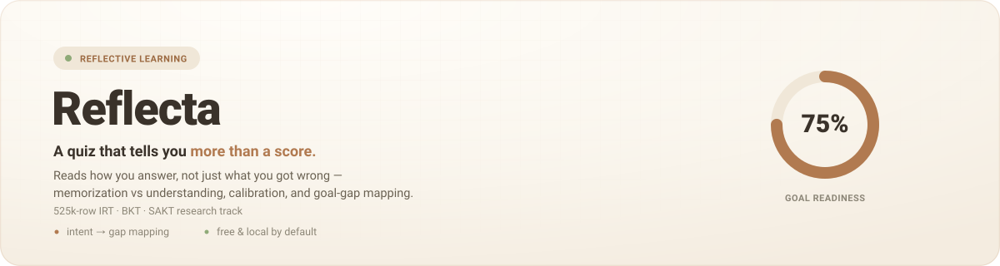
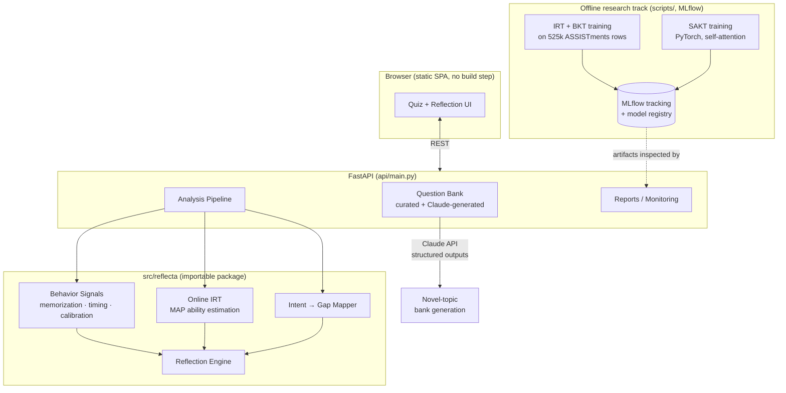

<div align="center">




<br/>

[](https://github.com/1mystic/reflecta/actions/workflows/ci.yml)
[](LICENSE)
[](pyproject.toml)
[](api/main.py)
[-EE4C2C.svg)](src/reflecta/models/sakt.py)
[](src/reflecta/tracking/experiment.py)

# Reflecta : [Live demo ](https://reflecta-j1wz.onrender.com/) 

</div>

---

## The 30-second pitch

Most quiz apps grade you and stop. Reflecta reads *how* you answer, your choices, your
timing, your stated confidence and tells you three things a raw score can't:

1. **Did you understand it, or memorize the phrasing?** The same concept is asked twice, worded
   differently. A big accuracy drop on the reworded twin means recognition without understanding.
2. **Are you calibrated?** Your confidence is compared against your actual accuracy
   (Expected Calibration Error) to catch over- and under-confidence.
3. **Does your mastery actually serve your goal?** Tell it *why* you're learning
   ("data science interview," "NEET biology," anything) and it maps your per-concept mastery
   onto that goal's requirements : surfacing the highest-leverage gap, not a generic weak spot.

Behind the quiz sits a genuine ML research track: an **Item Response Theory** model for
difficulty-aware mastery, and a from-scratch **BKT → SAKT (self-attentive) knowledge-tracing**
pipeline trained on **525,000 real learner interactions**, tracked with **MLflow**.

And it shows you the model thinking. A live **Cognitive Vitals** panel updates after every
answer — ability θ, the model's *certainty* (the Laplace posterior variance, free from the
fit), running calibration, and a reactive face — driven by a per-session online-IRT tick
that never leaks the answer key. A **Model Lab** page surfaces the real offline AUCs from
MLflow, and a live **architecture diagram** walks the whole request flow. The one-insight
technical write-up behind all of this is [`docs/WRITEUP.md`](docs/WRITEUP.md).

---

## Results (real data, honestly reported)

Trained on ASSISTments 2009 (525,534 interactions), evaluated on a **group-aware split by
learner** : the split discipline exists because a naive random split leaks and reports
artificially high scores (see [`docs/STORY.md`](docs/STORY.md) for why this matters and how it was found).

| Model | Task | Val AUC | Notes |
|---|---|---:|---|
| IRT (1PL) | next-answer probability, held-out learners | 0.506 | **Reported as a failure, not hidden.** 1PL can't estimate ability for a learner it never trained on — a textbook cold-start limitation. Documented, not glossed over. |
| BKT (per-skill) | next-answer probability | 0.763 | Interpretable HMM baseline; in the range reported in the literature for this dataset. |
| **SAKT** (self-attention) | next-answer probability | **0.803** | From-scratch PyTorch implementation — embeddings, causal masking, custom training loop. Beats BKT by 4 points. |

The IRT failure is the more interesting result: it's what motivated **online per-session
ability estimation** (`models/online_irt.py`) : freezing item difficulties and fitting just the
new learner's ability via MAP with a Gaussian prior, which is what actually powers live
mastery estimates in the product today. *Why the trained SAKT model isn't wired into the live
API yet* is answered directly in [`docs/GUIDEBOOK.md`](docs/GUIDEBOOK.md#serving-decisions), it's a
deliberate engineering call, not an oversight.

---

## What it looks like

*(try it live: [reflecta-j1wz.onrender.com](https://reflecta-j1wz.onrender.com/) — or run
`uvicorn api.main:app --reload` and open `localhost:8000`)*

The core flow: **goal + consent** → **quiz** (progress, live confidence slider, per-question
timing) → **reflection dashboard** (readiness ring, understanding/calibration tiles, ranked
gaps, plain-language reflection, full question review). Around it:

- **Cognitive Vitals** — a live panel that updates after every answer: a reactive SVG face,
  a certainty ring, and a marker riding the item-response curve, all driven by the
  per-session online-IRT tick (`POST /api/quiz/answer`, aggregate-only so it can't leak the
  key).
- **Model Lab** — the offline research track made visible: real ASSISTments AUCs, dataset
  size, and hyperparameters read live from MLflow, with an honest "online serves live,
  offline is research" split.
- **Architecture** — an animated component-by-component diagram of the whole request flow.
- **Reports** — model health, staleness/drift, and training metrics from MLflow: the kind of
  internal tooling this would need in production, built rather than skipped.

---

## Architecture



See [`docs/GUIDEBOOK.md`](docs/GUIDEBOOK.md) for the full design-decision log, the math behind
every signal (with derivations), and sequence diagrams for the live quiz flow.

## The five signals

| # | Signal | What it detects | Research basis |
|---|--------|-----------------|----------------|
| 1 | Memorization vs understanding | Accuracy drop on reworded twins of the same question | Paraphrase-invariance probing |
| 2 | Misconception diagnosis | *Which* wrong option → *which* misunderstanding | Distractor-signature mining |
| 3 | Calibration & mastery | Confidence vs correctness (ECE / Brier) | IRT · Knowledge Tracing (BKT/SAKT) |
| 4 | **Intent → gap (hero)** | Does mastery actually serve the stated goal? | Goal decomposition + mastery projection |
| 5 | Reflection | Specific, non-generic next steps | Rule-based synthesis over signals 1–4 |

---

## Engineering that's actually in here

- **Real 525k-row pipeline** : download → clean → group-aware split → train → track → persist,
  runnable end-to-end with one command ([`scripts/run_pipeline.py`](scripts/run_pipeline.py)).
- **From-scratch SAKT** in PyTorch — custom `Dataset`, causal-masked multi-head attention,
  training loop with validation AUC tracking ([`models/sakt.py`](src/reflecta/models/sakt.py)).
- **LLM-generated content with structured outputs** : novel quiz topics are generated by Claude
  via `messages.parse()` against a Pydantic schema (not string-parsed JSON), cached per topic,
  with graceful degradation when no API key is configured
  ([`generation.py`](src/reflecta/generation.py)).
- **Live per-session inference** : a `POST /api/quiz/answer` tick fits this learner's IRT
  ability from their answers-so-far and returns only aggregate belief-state — never the
  answer key — surfacing the posterior variance (free from the Newton fit) as a live
  "certainty" signal. Regression-tested against answer-key leakage.
- **MLOps, not just modeling** : MLflow experiment tracking + local model registry, a
  `/api/reports` endpoint reporting artifact staleness and live-session drift (surfaced on a
  Model Lab page), structured JSON logging, request IDs.
- **Production posture** : multi-stage Docker build, non-root user, gunicorn+uvicorn, health
  and readiness probes, per-IP rate limiting, CORS lockdown in prod, consent-gated storage with
  a right-to-erasure endpoint. See [`docs/SECURITY.md`](docs/SECURITY.md) /
  [`docs/PRIVACY.md`](docs/PRIVACY.md).
- **Tests + CI** — pytest suite covering the models and API, GitHub Actions running tests and a
  Docker build on every push.
- **Honest evaluation discipline** : every reported metric comes from a group-aware split by
  learner; the leakage failure mode that motivated this is documented in
  [`docs/STORY.md`](docs/STORY.md), not hidden.

---

## Quickstart

```bash
uv venv --python 3.12 && uv pip install -e ".[api,tracking,data]"

# train on real data (downloads ASSISTments, logs to local MLflow)
python scripts/download_data.py --dataset assistments
python scripts/run_pipeline.py --source assistments        # IRT + BKT -> models_store/
python scripts/train_sakt.py --epochs 6                    # needs .[neural] (torch)

# run the product
python -m uvicorn api.main:app --reload                    # http://localhost:8000

# or, Docker:
docker compose up --build                                  # http://localhost:8000
```

## Repo layout

```
reflecta/
├── api/                   # FastAPI: routes, schemas, monitoring, reports
├── src/reflecta/          # importable package — the actual ML/analysis core
│   ├── data/               # loaders, question bank, group-aware splitting
│   ├── features/            # behavior-signal extraction
│   ├── models/               # IRT, online IRT, BKT, SAKT, intent→gap
│   ├── reflection/            # rule-based reflection synthesis
│   ├── tracking/               # MLflow / W&B wrapper
│   ├── generation.py            # Claude-backed topic generation (structured outputs)
│   ├── monitoring.py             # model health / drift for the Reports page
│   ├── sessions.py                # disk-backed session + pending-quiz stores
│   └── serving.py                  # the seam between trained artifacts and live requests
├── scripts/                # download_data.py · run_pipeline.py · train_sakt.py
├── frontend/                # static SPA (no build step)
├── notebooks/                 # research notebooks (knowledge tracing, EDA)
├── tests/                       # pytest — models, API, frontend markup
├── docs/                          # all project documentation (see table below)
└── data/legacy_kaggle/              # the predecessor Kaggle competition
```

## Constraints & principles

- **Free-by-default, paid-optional** : the whole product runs with zero paid services; an
  Anthropic API key is optional and only unlocks quizzing on arbitrary topics.
- **Honest evaluation** : group-aware validation everywhere; failures are reported, not hidden.
- **Privacy by design** : anonymous sessions, explicit consent, automatic retention expiry,
  right-to-erasure endpoint.

## Documentation

| Doc | Covers |
|---|---|
| [`docs/GUIDEBOOK.md`](docs/GUIDEBOOK.md) | Full architecture, the math behind every signal, design-decision log, end-to-end flow diagrams |
| [`docs/STORY.md`](docs/STORY.md) | The Kaggle-to-Reflecta narrative, the 0.752 plateau, the pivot, the research arc |
| [`docs/WRITEUP.md`](docs/WRITEUP.md) | The single technical insight, publishable as a blog post: cold-start, group-aware splits, serve-vs-benchmark, and the free posterior variance |
| [`docs/PROJECT_PLAN.md`](docs/PROJECT_PLAN.md) | Milestone-by-milestone roadmap |
| [`docs/SECURITY.md`](docs/SECURITY.md) | Threat model, hardening measures |
| [`docs/PRIVACY.md`](docs/PRIVACY.md) | What's collected, what isn't, retention, erasure |
| [`docs/research.md`](docs/research.md) · [`docs/architecture.md`](docs/architecture.md) | Research spine and system architecture reference |
| [`docs/HANDOFF.md`](docs/HANDOFF.md) | Copy-paste context primer for starting a fresh session on this project |

## License

[MIT](LICENSE)
