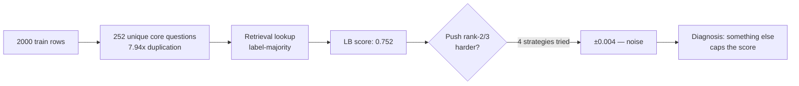
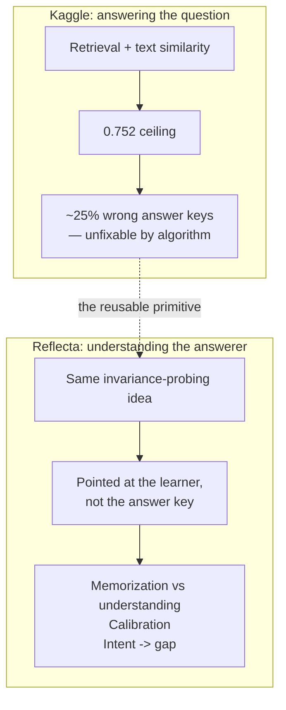
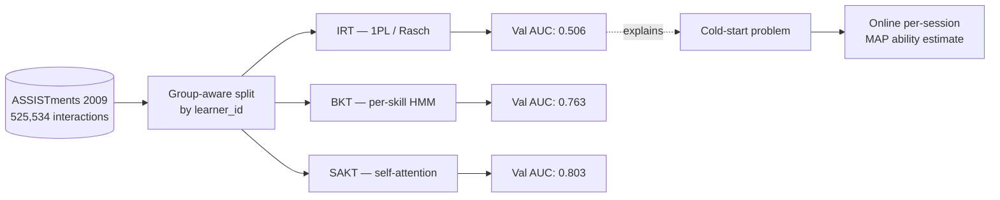
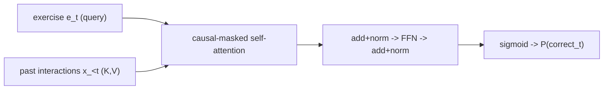
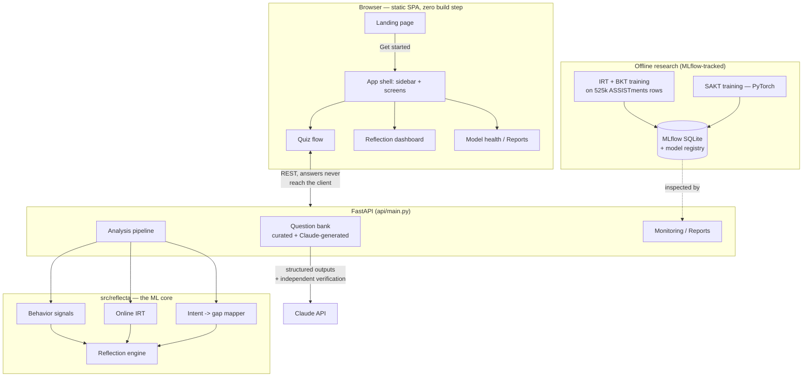
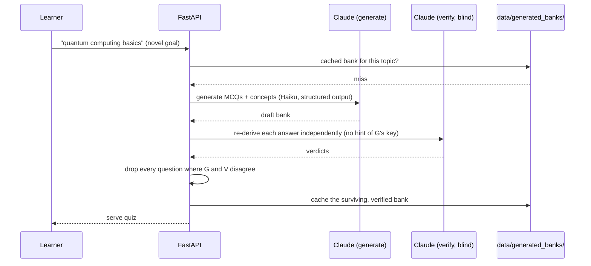

# From a 0.752 Kaggle score to a metacognition engine — the Reflecta story

*A technical narrative for anyone reviewing this project: what it is, why it exists, what
broke along the way, and what the numbers actually say. For the exhaustive reference
(every formula, every module), see [`GUIDEBOOK.md`](GUIDEBOOK.md). This is the story.*

---

## 1. It started as a Kaggle competition that hit a wall

The brief was ordinary: predict the top-3 ranked answers for 5-option MCQs, scored by
**MAP@3**. Train on 2,000 rows, submit on 500. A retrieval-based lookup got to **0.752**
fast — the training set had heavy duplication (7.94 copies per unique question on
average), so matching a test question to its training twin and returning the majority
label was already most of the signal.

Then progress stalled. Four different rank-2/3 strategies were tried — character
similarity, a bigram style language model, full-text matching, majority voting across
all three — and every one of them landed within **0.004** of each other. That's noise,
not signal. Something else was capping the score, and it wasn't a modeling problem.

### The diagnosis: the ceiling wasn't the model, it was the data

A leave-one-out experiment inside the training set gave label-majority retrieval a
**perfect 1.000 MAP@3** — zero label conflicts across 1,970 pairs tested. So the training
data was internally consistent. But every test question matched its training twin with
**similarity = 1.0** for the highest-leverage questions, meaning text drift couldn't
explain the gap either.

The only hypothesis left: **for roughly 25% of the training set's unique questions, the
answer key itself was wrong or genuinely ambiguous.** A leave-one-question-out model
trained on the *other* 251 questions disagreed with the recorded answer key on 146 of 252
questions (58%), with 58 of those disagreements at high confidence — startlingly close to
the ~57 questions the back-calculated error rate implied were actually wrong.

This is the finding the whole rest of this project is built on: **a real, human-authored
question bank had a ~25% wrong-or-disputed answer key rate, and no amount of retrieval
or feature engineering could fix that — because the ceiling wasn't in the algorithm.**

---

## 2. The pivot: stop answering, start understanding the answerer

Answering MCQs correctly was capped by data quality outside anyone's control. But the
underlying capability — *telling apart genuine understanding from surface pattern
matching* — is real and reusable. It's just aimed at the wrong target. Point it at a
**learner** instead of an answer key, and you get something genuinely useful: a system
that can tell whether a person actually understands a concept, not whether a lookup
table agrees with a label.

That's Reflecta: a **reflective learning intelligence layer**. You take a short quiz,
tell it *why* you're learning, and it tells you three things a raw score can't —

1. **Did you understand it, or memorize the phrasing?** Every quiz includes reworded
   twins of the same question. A big accuracy drop on the reworded version is the same
   invariance-probing idea from the Kaggle project, now pointed at a human.
2. **Are you calibrated?** Confidence is compared against actual accuracy (Expected
   Calibration Error) to catch over- and under-confidence.
3. **Does your mastery serve your actual goal?** State your goal in plain English; your
   per-concept mastery is projected onto what that goal requires, surfacing the
   highest-leverage gap — not a generic list of weak spots.

---

## 3. The research: three models, one honest failure, and why that failure matters

"Mastery" needs a principled definition, not just raw percent-correct — percent-correct
conflates *how hard the questions were* with *how able the learner is*. Three models were
built, in order of complexity, all trained on **real data**: **525,534 interactions** from
the ASSISTments 2009 knowledge-tracing dataset, split **by learner** (never by row) so
that duplicate-leakage — the exact trap that inflated the Kaggle project's validation
scores — can't happen again.

### 3.1 — IRT (Item Response Theory), and its honest failure

The classic Rasch model: `P(correct) = sigmoid(θ_learner − b_item)`, fit by maximum
likelihood via gradient ascent. On held-out learners it scored **AUC 0.506** — barely
above the coin-flip line.

That's not a bug. It's the textbook cold-start problem: 1PL IRT has no way to estimate
`θ` for a learner it never trained on. The number is reported as-is, not hidden, because
it's the most important negative result in the whole project — it's what motivated
**online ability estimation**: freeze the item difficulties learned offline, then fit
*just the new learner's* `θ` via MAP with a Gaussian prior, from their live quiz answers.
That's what actually estimates mastery for a real learner today.

### 3.2 — BKT (Bayesian Knowledge Tracing) — **AUC 0.763**

A 2-state HMM per skill, tracking `P(knows)` over a learner's sequence of attempts —
interpretable, and a strong classical baseline, comparable to published numbers on this
dataset.

### 3.3 — SAKT (Self-Attentive Knowledge Tracing) — **AUC 0.803**

A from-scratch PyTorch implementation: causal-masked self-attention over the interaction
sequence, so the prediction for the next exercise can attend over the whole history, not
just the current skill. Custom `Dataset`, custom training loop, validation AUC tracked
per epoch — it beat BKT by 4 points, landing in the range published research reports for
this exact dataset.

### 3.4 — Why the trained SAKT isn't in the live product (yet)

This is worth stating plainly rather than glossing over: SAKT is trained on
**ASSISTments' exercise vocabulary**. The live quiz bank is a *different, disjoint* item
space (curated + Claude-generated questions with their own concept taxonomy). Serving
live sessions through the ASSISTments-trained model would mean looking up embeddings for
exercise IDs it never saw — silently meaningless output, not just suboptimal. That's the
same cold-start/domain-mismatch failure mode as the IRT result above, applied to a
different model. Online IRT (§3.1) serves live mastery today because it only needs the
quiz bank's authored item difficulties, not a model trained on someone else's item space.
The fix — training a KT model on the bank's own exercise space once enough consented
product sessions exist — is a tracked roadmap item, not a silent gap.

---

## 4. Turning research into a product: architecture

### Quizzing on any topic — and not repeating the label-noise mistake

The curated bank covers "data science interview." For anything else, a topic bank is
generated on the fly by Claude, using **structured outputs** (`messages.parse()` against
a Pydantic schema — the API validates the JSON shape itself, not a hand-rolled parser).

Here's the part that closes the loop with §1: an LLM-generated answer key is not
automatically trustworthy. **A second, independent Claude call re-derives every answer
from scratch** — the question and options only, with no hint of what the first call
marked correct — and any question where the two calls disagree is dropped before the
bank is cached. This is a direct, structural response to the finding that started this
whole project: a ~25% wrong-key rate in a *human-authored* dataset means an
*LLM-authored* one needs the same scrutiny, not blind trust.

---

## 5. Debugging in the open: three real bugs, fixed with evidence

A portfolio project is more credible when it shows the debugging, not just the demo.
Three real, user-reported bugs were root-caused and fixed during development, each
verified over live HTTP rather than assumed fixed:

**`.env` silently ignored.** Settings are read via `os.getenv()` as dataclass field
defaults — evaluated once at *module import time*, not at first use. Nothing called
`python-dotenv`, so a correctly-set `ANTHROPIC_API_KEY` in `.env` was invisible to the
app; every setting quietly fell back to its hardcoded default. Fixed by loading `.env`
at the top of `config.py`, before any `os.getenv()` executes — order matters here in a
way that's easy to get subtly wrong.

**A goal that was "curated" without any curated content.** `"neet biology"` was listed in
the intent-gap resolver's requirement library, but the actual question bank had zero
biology questions in it. The code trusted the resolver's static list alone, so selecting
that goal would silently serve **data-science questions scored against biology gap
requirements** — a nonsensical reflection, and worse, a *silent* one (200 OK, wrong
content). The fix requires the goal's concepts to actually overlap with the bank's real
content before treating it as "curated," with a regression test asserting the mismatch
can't happen again.

**A `<select>` with buttons pointing at options that didn't exist.** A segmented
question-count control (8 / 12 / 18) wrote into a hidden `<select>` via
`select.value = "8"`. Per the HTML spec, setting `.value` to a string with no matching
`<option>` silently resets it to `""` — not an error, not a console warning. That
produced `parseInt("", 10)` → `NaN` → `JSON.stringify(NaN)` → `null` → a genuinely
confusing 422 ("`n_questions`: Input should be a valid integer") for every question count
except whichever one happened to have a literal `<option>` in the markup. Fixed by adding
the missing options and a defensive fallback, with a markup-invariant test that would
have caught it before it shipped.

Each of these got a **permanent regression test** — not just a fix — specifically because
each is the kind of defect that silently reappears if the invariant it violates isn't
written down somewhere a test suite checks.

---

## 6. Engineering practice, not just a model

- **Group-aware evaluation, everywhere.** Every reported metric in this project comes
  from a split where whole learners are held out — the direct lesson from the Kaggle
  project's leaked 0.92-validation-vs-0.73-leaderboard gap.
- **MLflow tracking + a local model registry.** Local SQLite backend, zero account, still
  inspectable via `mlflow ui` and via the product's own `/api/reports` endpoint, which
  reports artifact staleness ("is anything rotting?") and live-session drift.
- **Privacy by design.** Consent-gated storage, anonymous opaque session IDs (no name,
  email, or IP), automatic retention expiry, and a right-to-erasure endpoint —
  `DELETE /api/session/{id}`.
- **Production posture.** Multi-stage Docker build, non-root container, gunicorn +
  uvicorn workers, health/readiness probes, per-IP rate limiting, CORS lockdown in
  production, structured JSON logs with request IDs.
- **Tests as documentation of what broke.** Beyond model correctness tests, the test
  suite includes markup-level regression tests for the exact DOM/browser-semantics bugs
  described in §5 — a class of defect that unit tests on the backend alone can't see.

---

## 7. What's honestly still missing

This project does not claim to be finished, and the audit that produced most of the fixes
above is a better source of truth than marketing copy would be:

- **SAKT isn't serving live traffic** — see §3.4. Tracked, not silent.
- **Signals are statistically thin at quiz scale.** A 12-question quiz gives 2–3 answers
  per concept; the calibration and mastery numbers are directionally right but shouldn't
  be over-trusted at that sample size. Longitudinal tracking (an opaque, client-persisted
  learner ID that accumulates a readiness trend across repeat quizzes) is a first step
  toward more data per learner over time, not a full fix.
- **No real-world usage evidence yet.** The hypothesis — that seeing your memorization
  index and calibration error changes how you study — is untested at any scale beyond
  development.

---

## Where to go next

- [`../README.md`](../README.md) — quickstart, results table, architecture diagram
- [`GUIDEBOOK.md`](GUIDEBOOK.md) — the exhaustive reference: every formula, every design
  decision, a full glossary
- [`legacy/`](legacy/) and [`../data/legacy_kaggle/`](../data/legacy_kaggle/) — the
  original Kaggle project this all grew out of
- [`PROJECT_PLAN.md`](PROJECT_PLAN.md) — the milestone-by-milestone roadmap
